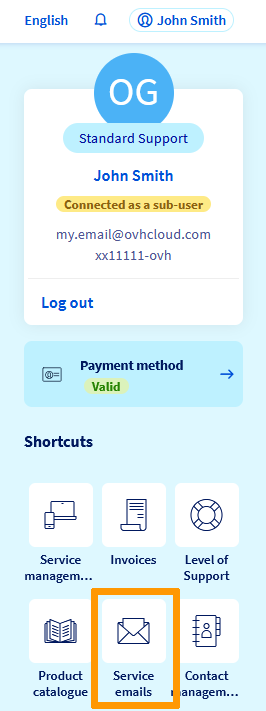

**Last updated 29th March 2022**

## Objective

This guide will give you all the tips to properly manage your account and the billing of your OVHcloud services.

**This guide explains how to set your OVHcloud services/account in order to prevent any interruption or irregularity.**

> [!warning]
> OVHcloud is providing you with services for which you are responsible, with regard to their configuration and management. You are therefore responsible for ensuring they function correctly.
>
> This guide is designed to assist you in common tasks as much as possible. Nevertheless, we recommend that you contact a specialist service provider and/or discuss the issue with our community on <https://community.ovh.com/en/> if you face difficulties or doubts. You can find more information in the [Go further](#gofurther) section of this guide.
>

## Requirements

- Access to the [OVHcloud Control Panel](https://www.ovh.com/auth/?action=gotomanager&from=https://www.ovh.co.uk/&ovhSubsidiary=GB)
- Active OVHcloud services in your OVHcloud account 

## Instructions

### Account settings

#### Personal information

As a customer, you want to have an account which is up to date in terms of personal data. It is necessary for security and for the good functioning of your services.

To check your personal details:

- Click on your name at the top right of your screen.
- Click on your initials (`Manage my account`{.action}) in the right-hand menu.
- Then, in the `My profile`{.action} section on the right of your screen, click on `...`{.action}, then `Edit my profile`{.action}.

{.thumbnail}

For more information, read the guide [Securing my OVHcloud account and managing my personal information](https://docs.ovh.com/gb/en/customer/all-about-your-username/#how-to-manage-your-personal-details_1).

Ensure your email address is always up to date and secured. You must have access to it as OVHcloud will send you information and notices about your account and services. Add a **backup email** to prevent loss of access to the main one.

Note that emails sent by OVHcloud will be also visible in your [OVHcloud Control Panel](https://www.ovh.com/auth/?action=gotomanager&from=https://www.ovh.co.uk/&ovhSubsidiary=GB):

- Click on your name at the top right of your screen.
- Click on `Service emails`{.action} in the right-hand menu.

{.thumbnail}

#### Payment method

In order to prevent any service interruption and for the good functioning of the autorenewal, we recommend that you [register a payment method](https://docs.ovh.com/gb/en/billing/manage-payment-methods/) in your [OVHcloud Control Panel](https://www.ovh.com/auth/?action=gotomanager&from=https://www.ovh.co.uk/&ovhSubsidiary=GB).

#### Account security

[Create a strong password](https://docs.ovh.com/gb/en/customer/manage-password/#generate-a-strong-password) which will ensure your account privacy.

[Enable two factor authentification](https://docs.ovh.com/gb/en/customer/secure-account-with-2FA/) to prevent any fraudulent access.

For the security measures to be efficient, make sure your email addresses (main and backup) and your mobile number are up-to-date and accessible.

### Order follow-up

Did you know that you can [track your orders](https://docs.ovh.com/gb/en/billing/managing-ovh-orders/) in your [OVHcloud Control Panel](https://www.ovh.com/auth/?action=gotomanager&from=https://www.ovh.co.uk/&ovhSubsidiary=GB)? Just navigate to the `Dashboard`{.action} tab at the top menu of your screen, then click on `View my orders`{.action}.

{.thumbnail}

You will find out the steps of delivery and you will know if actions are required from your side.

### Renewal of OVHcloud services

In order to prevent any service interruption, OVHcloud recommends you to activate [automatic renewal (autorenew)](https://docs.ovh.com/gb/en/billing/how-to-use-automatic-renewal-at-ovh/) on your services. Your invoices will then be automatically paid with your default payment method.

If you don't [register a payment method](https://docs.ovh.com/gb/en/billing/managing-ovh-orders/), you will receive notifications, inviting you to perform a manual payment to either renew your service in advance or settle your pending invoice.

### Termination

#### Service termination

If you want to stop using one of your services, you can either cancel it, set its renewal to manual mode or delete it immediately through your [OVHcloud Control Panel](https://www.ovh.com/auth/?action=gotomanager&from=https://www.ovh.co.uk/&ovhSubsidiary=GB).

First click on your name at the top right of your screen, then on `Service management`{.action}. On the right side of your screen, click on the `...`{.action} button corresponding to the service you want to act on, then click on one of the following buttons:

- `Configure renewal`{.action}: On the following screen, you'll be able to switch the `Renewal type` of your service to `Manual`. Then click on `Next` and `Confirm`. Before the expiration date of your service, you will receive several notifications by email. If you don't renew your service, it will be **permanently** deleted.
- `Cancel`{.action}: On the following screen, specify the reasons for your cancellation request, then click on `Confirm`{.action}. On the expiration date of your service, it will be **permanently** deleted.
- `Delete ... immediately`{.action}: on the following screen, click on `Confirm`{.action}. You service will be **immediately and permanently** deleted.

To get more information about termination of your services, consult the [How to cancel your OVHcloud services](https://docs.ovh.com/gb/en/billing/how-to-cancel-your-services/) guide.

#### Account closure

If you want to definitely close your OVHcloud personal account, first check that it doesn't contain active services, pending invoices or ongoing orders. Then, use [this form](https://www.ovh.co.uk/personal-data-protection/exercise-your-rights?lsdDoc=exercising-your-rights) to ask for the permanent deletion of your account.

## Go further 

[Beware of scams – recognising fraudulent email and phishing](https://docs.ovh.com/gb/en/customer/scams-fraud-phishing/)

[Managing OVHcloud bills](https://docs.ovh.com/gb/en/billing/manage-ovh-bills/)

Join our community of users on <https://community.ovh.com/en/>.
