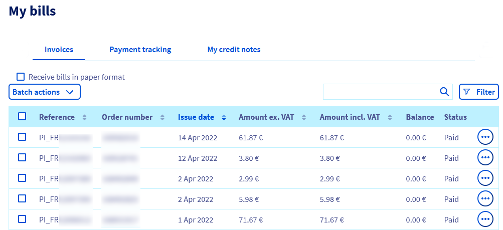

**Letzte Aktualisierung am 20.04.2022**

## Einleitung

OVHcloud stellt Ihnen einen Bereich zur Verfügung, über den Sie alle Ihre Rechnungen einsehen, verwalten und begleichen können, ohne dass Ihre Dienste dabei unterbrochen werden.

**In dieser Anleitung erfahren Sie, wie Sie die verschiedenen Aktionen für Ihre Rechnungen vornehmen können.**

> [!primary]
>
> In Abhängigkeit von Ihrem Wohnsitz und der dort geltenden Rechtsordnung sowie den betreffenden Produkten können einige Details von den hier angeführten Informationen abweichen und/oder Teile dieser Anleitung nicht auf Ihre Situation zutreffen. Im Zweifel beachten Sie bitte die für Sie geltenden OVHcloud Verträge, die Sie jederzeit in Ihrem [Kundencenter](https://www.ovh.com/auth/?action=gotomanager&from=https://www.ovh.de/&ovhSubsidiary=de){.external} im Bereich `Produkte und Dienstleistungen`{.action}, unter `Verträge`{.action} einsehen können.
>

## Voraussetzungen

- Sie sind im [OVHcloud Kundencenter](https://www.ovh.com/auth/?action=gotomanager&from=https://www.ovh.de/&ovhSubsidiary=de){.external} eingeloggt.
- Sie sind der Rechnungskontakt für Ihren Dienst (mehr Informationen zu den verschiedenen Kontakten finden Sie in der Anleitung “[Verwaltung der Kontakte Ihrer Dienstleistungen](https://docs.ovh.com/de/customer/verwaltung-der-kontakte/){.external}”).

## Beschreibung

> [!primary]
> Update - Januar 2021
>
Ihre Rechnung, wenn sie von OVHcloud erstellt wird, wird Ihnen per E-Mail in Form eines klickbaren Links zugesandt, auf den Sie direkt zugreifen können, indem Sie sich in Ihrem OVHcloud Kundencenter authentifizieren. Alle Rechnungen bleiben auch über das Dashboard Ihres OVHcloud Kundencenters verfügbar.
>

### Aufbau Ihrer Rechnung

Sie erhalten von uns eine Rechnung, wenn Sie eine Bestellung bezahlen müssen oder wenn einer Ihrer Dienste automatisch verlängert wurde. Auf der Rechnung werden die bereits bezahlten oder zu bezahlenden Produkte aufgeführt - eventuell zusammen mit den entsprechenden Verlängerungszeiträumen und den Gesamtkosten für die Dienste. Die Rechnungsnummer beginnt immer mit dem Ländercode des jeweiligen OVHcloud Sitzes (zum Beispiel “DE” für Deutschland, “FR” für Frankreich usw.).

{.thumbnail}

|Nummer|Beschreibung|
|---|---|
|1|Die Rechnungsinformationen, wie Rechnungsnummer, Ausstellungsdatum, zugehöriger Bestellschein, Zahlungsmittel und Kundenkennung.|
|2|Informationen zum Rechnungskontakt.|

Im Folgenden werden Ihnen Details zu den abgerechneten Diensten aufgeführt:

- Abonnement: Beschreibung des Dienstes und des Abrechnungszeitraums;
- Domain: Referenz des abgerechneten Dienstes;
- Menge: Anzahl der Einheiten des abgerechneten Dienstes;
- Stückpreis und Preis ohne MwSt.: Tarif des Dienstes.

Die Steuern werden auf der Rechnung erst unten beim Gesamtpreis “Total inkl. MwSt.” hinzugefügt.

> [!primary]
>
> Wenn unter verwendetes Zahlungsmittel “Bankeinzug” angegeben ist, dann handelt es sich um eine automatische Verlängerung, die von Ihrem Account abgebucht wird. Das genutzte Zahlungsmittel ist das Mittel, das in Ihrem [OVHcloud Kundencenter](https://www.ovh.com/auth/?action=gotomanager&from=https://www.ovh.de/&ovhSubsidiary=de){.external} hinterlegt wurde.
>

### Der Abrechnungsbereich in Ihrem Kundencenter

#### Rechnungen einsehen und verwalten

Wenn Sie in Ihrem [OVHcloud Kundencenter](https://www.ovh.com/auth/?action=gotomanager&from=https://www.ovh.de/&ovhSubsidiary=de){.external} angemeldet sind, klicken Sie oben rechts auf Ihren Namen, um über `Rechnungen`{.action} den Abrechnungsbereich aufzurufen.

{.thumbnail}

Sie gelangen dann auf eine Übersichtsseite, auf der alle Ihre Rechnungen aufgelistet werden:

{.thumbnail}

Hier finden Sie zu jeder Tabellenzeile folgende Informationen:

- die Rechnungsnummer (zum Beispiel: DE12345678);
- die Bestellnummer der Rechnung
- das Ausstellungsdatum;
- den gesamten Rechnungsbetrag;
- den noch ausstehenden Betrag;
- die Rechnungsfrist;
- `...`{.action}: verschiedene Aktionen.

> [!primary]
>
> Wenn der noch ausstehende Rechnungsbetrag rot markiert ist, dann muss diese Rechnung bezahlt werden. Die Rechnungsfrist gibt Ihnen an, ob eine Zahlung sofort fällig ist.
>

Wenn “Keine Informationen verfügbar” angegeben ist, dann bezieht sich die Rechnung nicht auf eine automatische Verlängerung. Klicken Sie auf die drei Punkte`...`{.action}, um weitere Aktionen auszuführen. Sie können aus den folgenden Optionen wählen:

{.thumbnail}

- `Die HTML Version anzeigen`{.action}: die Rechnung wird in einem neuen Tab als HTML in Ihrem Browser angezeigt;
- `Die PDF Version anzeigen`{.action}: die Rechnung wird als PDF-Dokument anzeigt, das Sie herunterladen können;
- `Details zu dieser Rechnung anzeigen`{.action}: Sie können den Verlauf der zu dieser Rechnung bereits getätigten Aktionen überprüfen.

Nutzen Sie die vorgegebenen Such- und Filterfunktionen, um leicht den Überblick zu behalten:

{.thumbnail}

Um eine bestimmte Rechnung zu finden, können Sie die Rechnungsnummer eingeben oder über die Filter auf eine bzw. mehrere Rechnungen innerhalb eines bestimmten Zeitraums (drei Monate, sechs Monate, ein Jahr oder einen benutzerdefinierten Zeitraum) eingrenzen.

Um eine Übersicht der von Ihnen ausgewählten Rechnungen als Excel-Datei im .csv-Format herunterzuladen, klicken Sie auf den Button `CSV exportieren`{.action}. In dieser Datei werden Ihnen Rechnungsbetrag, Rechnungsnummer und das Ausstellungsdatum dieser Rechnungen aufgelistet.

#### Rechnung begleichen 

Um ausstehende Rechnungen zu begleichen, müssen Sie lediglich auf den Button `Rechnung sofort begleichen`{.action} klicken.

{.thumbnail}

Wir erstellen Ihnen für den Zahlungsvorgang dann einen [Bestellschein](https://docs.ovh.com/de/billing/bestellungen-verwalten-ovh/){.external}. Nach Bezahlung ist Ihr Account beglichen.

### Zahlungsverfolgung

Sie können alle Ihre Zahlungen im Bereich `Abrechnungen` unter `Zahlungsverfolgung`{.action} nachverfolgen. Auf dieser Seite werden Ihnen alle Rechnungen mit den zugehörigen Beträgen und Zahlungsmitteln angezeigt. Die Referenz eines Zahlungsbelegs beginnt immer mit den Buchstaben “PA_DE”.

{.thumbnail}

In diesem Bereich können Sie ebenfalls Ihre Zahlungsbelege im .csv-Format exportieren. Nutzen Sie auch hier die Filterfunktionen, um sich bestimmte Zeiträume anzeigen zu lassen.

> [!primary]
>
> Sollten Sie einen Unterschied zwischen gezahltem Betrag und Rechnungsbetrag feststellen, dann hatten Sie auf Ihrem Account ein Guthaben, von dem der Rechnungsbetrag automatisch abgezogen wurde.
>

## Weiterführende Informationen

Für den Austausch mit unserer User Community gehen Sie auf <https://community.ovh.com/en/>.
