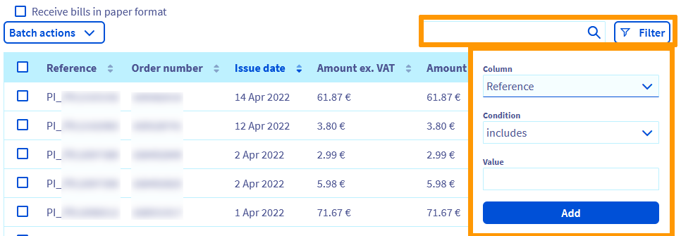
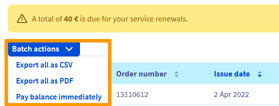

**Ostatnia aktualizacja z dnia 20-04-2022**

## Wprowadzenie

OVHcloud oddaje do Twojej dyspozycji Panel klienta, w którym możesz wyświetlać, zarządzać i regulować płatności.

**Ten przewodnik wyjaśnia, jak wykonywać operacje w menu dotyczącym płatności.**

> [!primary]
>
> Możliwe, że niektóre części niniejszego przewodnika nie mają zastosowania do Twojej sytuacji, która może różnić się w zależności od tego, gdzie znajduje się siedziba Twojej firmy i pod jakie podlega ustawodawstwo. Jeśli masz wątpliwości, sprawdź zapisy w umowach OVHcloud dostępnych w [Panelu klienta](https://www.ovh.com/auth/?action=gotomanager&from=https://www.ovh.pl/&ovhSubsidiary=pl){.external}, sekcja `Produkty i usługi`{.action} > `Regulaminy`{.action}.
>

## Wymagania początkowe

- Dostęp do [Panelu klienta](https://www.ovh.com/auth/?action=gotomanager&from=https://www.ovh.pl/&ovhSubsidiary=pl){.external}
- Zalogowanie jako kontakt księgowy (więcej szczegółów o rodzajach kontaktów w przewodniku [Zarządzanie kontaktami](https://docs.ovh.com/pl/customer/zarzadzanie_kontaktami/){.external})

## W praktyce

> [!primary]
> Aktualizacja - styczeń 2021
>
Faktura wystawiona przez OVHcloud jest wysyłana e-mailem za pomocą linku klikniętego i dostępnego bezpośrednio w Panelu klienta OVHcloud. Każda faktura jest również dostępna na dashboardzie w Panelu klienta.
>

### Informacje na Twojej fakturze

Faktura zostaje do Ciebie wysłana w momencie, gdy uregulujesz płatność za usługę lub po automatycznym odnowieniu. Znajdują się na niej informacje dotyczące produktów, za które należność została uregulowana lub oczekuje na uregulowanie oraz terminy odnowienia usług wraz z cenami. Numer faktury zaczyna się zawsze od liter “PL”.

{.thumbnail}

|Numer|Opis |
|---|---|
|1|Informacje na fakturze, numer, data wystawienia, zamówienie, do którego się odnosi, rodzaj płatności oraz identyfikator klienta.|
|2|Podsumowanie informacji dotyczących kontaktu księgowego.|

Poniżej znajdują się szczegóły dotyczące fakturowanych usług:

- “Opłata za usługę”: opis usługi oraz okres rozliczeniowy, za który naliczona jest należność;
- “Domena”: oznaczenie fakturowanej usługi;
- “Ilość”: liczba jednostek fakturowanej usługi; 
- “Cena jednostkowa netto” i “Wartość netto”: cena usługi.

Kwota podatku jest wyszczególniona na dole w podsumowaniu całkowitej kwoty należności oznaczonej: “Razem brutto”.

> [!primary]
>
> Jeśli przy użytym sposobie płatności pojawia się napis “Termin zapłaty wg regulaminu”, oznacza to, że usługa objęta jest automatycznym odnowieniem. Użyty sposób płatności to sposób zarejestrowany w [Panelu klienta](https://www.ovh.com/auth/?action=gotomanager&from=https://www.ovh.pl/&ovhSubsidiary=pl){.external}.
>

### Sekcja płatności w Panelu klienta

#### Wyświetlanie i zarządzanie fakturami

Aby wyświetlać faktury, przejdź do sekcji `Faktury`{.action} w [Panelu klienta](https://www.ovh.com/auth/?action=gotomanager&from=https://www.ovh.pl/&ovhSubsidiary=pl){.external}, klikając Twoje imię na górze po prawej stronie.

{.thumbnail}

Zostaniesz wówczas przekierowany do strony z listą Twoich faktur:

{.thumbnail}

W poszczególnych wierszach tabelki znajdziesz następujące informacje:

- numer faktury (np.:  PL12345678);
- data wystawienia faktury
- kwota należności na fakturze;
- saldo do uregulowania;
- termin płatności faktury;
- `...`{.action}: możliwe będą różne działania.

> [!primary]
>
> Jeśli saldo do uregulowania wyświetla się na czerwono, faktura oczekuje na realizację płatności. Data płatności wskazana na fakturze informuje Cię, że płatność jest wymagalna natychmiast.
>

Jeśli wyświetla się napis “Informacja niedostępna”, oznacza to, że faktura nie jest powiązana z automatycznym odnowieniem. Możesz wyświetlić te informacje, klikając na `...`{.action}. Możesz wybrać spośród następujących opcji:

{.thumbnail}

- `Wyświetl wersję HTML`{.action}: faktura otworzy się w nowej zakładce w przeglądarce internetowej;
- `Wyświetl wersję PDF`{.action}: wygenerowany zostanie plik w formacie PDF, który będziesz mógł pobrać;
- `Sprawdź szczegóły dla tego zadłużenia`{.action}: będziesz mógł sprawdzić historię operacji na niezapłaconym saldzie.
- `Ureguluj saldo teraz`{.action}: umożliwia utworzenie zlecenia zakupu w celu natychmiastowej zapłaty zaległego salda.

Dostępnych jest kilka filtrów ułatwiających sortowanie faktur:

{.thumbnail}

Aby odnaleźć konkretną fakturę, wprowadź jej numer lub wyszukaj fakturę(y) w danym okresie: trzech miesięcy, sześciu miesięcy, roku lub w innym wskazanym przez Ciebie przedziale czasu.

Przycisk `Eksportuj w CSV`{.action} umożliwia pobranie pliku Excel w formacie .csv, w którym wyszczególnione będą wybrane faktury. Plik ten będzie zawierał kwotę, numer i datę wystawienia faktur.

#### Opłacanie rachunków 

Aby uregulować zaległe płatności, kliknij przycisk `Ureguluj saldo teraz`{.action}.

{.thumbnail}

Utworzony zostanie wówczas formularz [zamówienia](https://docs.ovh.com/pl/billing/zarzadzanie-zamowieniami-ovh/#zamowienie){.external} umożliwiający uregulowanie należnej kwoty. Po dokonaniu płatności saldo zostanie uregulowane.

### Śledzenie płatności

Możesz śledzić dokonane płatności w zakładce`Płatności` w sekcji `Informacje o płatnościach`{.action}. Pozwala to na powiązanie faktur z odpowiadającymi im płatnościami. Numer dokumentu potwierdzającego uregulowanie salda zaczyna się zawsze od liter “PA_PL”.

{.thumbnail}

Z tej sekcji możesz również eksportować dokumenty potwierdzające płatność w formacie .csv. Podobnie jak w przypadku faktur, możesz sortować je według wybranych okresów.

> [!primary]
>
> Jeśli zauważysz różnicę między płatnością a kwotą na fakturze, oznacza to, że otrzymałeś zwrot płatności lub rekompensatę, która automatycznie pomniejszyła kwotę do zapłaty.
>

## Sprawdź również

Przyłącz się do społeczności naszych użytkowników na stronie <https://community.ovh.com/en/>.
