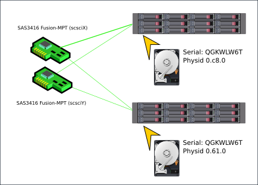
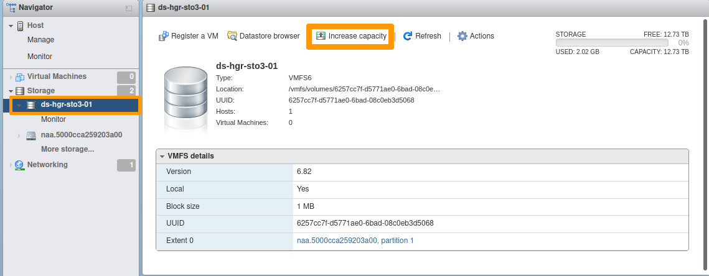
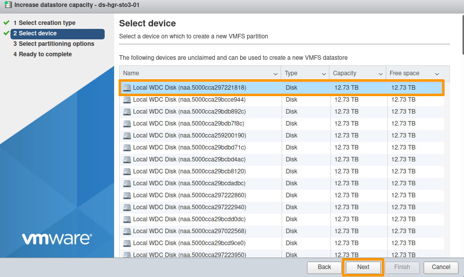

**Dernière mise à jour le 25/09/2022**

## Objectif
La baie HGR-STOR-3 présente les mêmes disques sous différents périphérique logique ('devices') au système d'exploitation. 

En fonction des systémes,sans post-configuration spécifique, ceci peut être source de confusion ( Ou sont mes données ? ), voir pire source de collisions ( Accès involontaire au même disque physique pout des usages différents  ) ceci pouvant causer la perte de vos données.


En fonction de votre système, une post-configuration peut-être nécessaire afin de mettre en place les fonctionnalitées _multipath_.

Le Multipath permet d'aggréger les différentes possibilitées d'accès au même disque ( path ) en tant que device logique unique.

Cette documentation détaille: 
- Les templates Ohv compatibles (testé par nos equipes)
- Le mode opératoire de post-configuration par OS.

> [!primary]
>
> A ce jour de toutes les distributions n'ont pas encore été testées. 
> Vous ne trouverez que les versions les plus récente des systèmes.
> 


** Prérequis **

## Prérequis OVH

Votre serveur doit être associé à une baie HGR-STOR-3 ( Nom commercial: _HGR-STOR-3_)


La baie expose 102 Disques de 14 To de type SAS


## HGR-STOR-3

Cette baie présente pour chaque disque vu de l'OS :
* Deux disques physiques ( exposant le même numero de série )
* Accéder par deux controlleur SAS

Il y a donc en tout quatre manière d'accéder à un disque vu par le système:

- Controleur SAS 1 -> Disque A
- Controleur SAS 1 -> Disque B
- Controleur SAS 2 -> Disque A
- Controleur SAS 2 -> Disque B

Exemple d'acces multipath



Ceci est repliqué pour les 102 disques.

### Liste des système d'exploitations

| Template | Procédure | Remarques |
|----------|-----------|-----------|
|ESXI 7| [Section ESXI-7](#esxi7) ||
|AlmaLinux 8|[Section AlmaLinux 8, Rocky Linux 8, Fedora 34 Server](#redhatlike)||
|Rocky Linux 8|[Section AlmaLinux 8, Rocky Linux 8, Fedora 34 Server](#redhatlike) ||
|Fedora 34 Server|[Section AlmaLinux 8, Rocky Linux 8, Fedora 34 Server](#redhatlike) ||
|Proxmox VE 7| [Section Proxmox VE 7](#proxmoxve7)||
|Ubuntu Server 22.04 LTS|[Section Ubuntu Server 22.04 LTS](#ubuntu22)||||
|Debian (toute version) | Non supporté, en cours d'investigation ||

---

### ESXI-7  <a name="esxi7"></a>

Esxi n'a pas besoin d'installation de composants supplémentaires, le multipath est automatiquement géré.

Si nécessaire vous pouvez proceder aux vérifications décritent ci-dessous.

#### Vérifications
Vous connecter via ssh en shell sur votre Esxi.

##### Liste des adapateurs
Vérifier que l'Esxi a bien détecté les deux controlleur SAS de type similaire à ce qui suis 

```bash
[root@nsxxxxxx:~] esxcli storage san sas list
   Device Name: vmhba2
   SAS Address: 50:06:05:b0:10:62:88:e0
   Physical ID: 0
   Minimum Link Rate: 3000 Mbps
   Maximum Link Rate: 12000 Mbps
   Negotiated Link Rate: 12000 Mbps
   Model Description: HBA 9400-16e - 1000:ac:1000:3020
   Hardware Version: 0x01
   OptionROM Version:
   Firmware Version: 20.00.00.00 - Firmware Package Version: 20.00.00.00
   Driver Name: lsi_msgpt35
   Driver Version: 19.00.02.00
 
   Device Name: vmhba3
   SAS Address: 50:06:05:b0:10:62:83:b0
   Physical ID: 0
   Minimum Link Rate: 3000 Mbps
   Maximum Link Rate: 12000 Mbps
   Negotiated Link Rate: 12000 Mbps
   Model Description: HBA 9400-16e - 1000:ac:1000:3020
   Hardware Version: 0x01
   OptionROM Version:
   Firmware Version: 20.00.00.00 - Firmware Package Version: 20.00.00.00
   Driver Name: lsi_msgpt35
   Driver Version: 19.00.02.00
```

##### Liste des disques

```bash
root@nsxxxxxx:~] esxcli storage core device list | grep 'Display Name: Local WDC Disk'
   Display Name: Local WDC Disk (naa.5000cca259203a00)
   Display Name: Local WDC Disk (naa.5000cca297221818)
   Display Name: Local WDC Disk (naa.5000cca29bcce944)
   Display Name: Local WDC Disk (naa.5000cca29bdb892c)
   Display Name: Local WDC Disk (naa.5000cca29bdb7f8c)
   Display Name: Local WDC Disk (naa.5000cca259200190)
   Display Name: Local WDC Disk (naa.5000cca29bce8054)
   Display Name: Local WDC Disk (naa.5000cca297220004)
   Display Name: Local WDC Disk (naa.5000cca29bdb3440)
   Display Name: Local WDC Disk (naa.5000cca29bdbb458)
...
   Display Name: Local WDC Disk (naa.5000cca29bdb1114)
   Display Name: Local WDC Disk (naa.5000cca29bcddf94)
   Display Name: Local WDC Disk (naa.5000cca29bce7dd4)
   Display Name: Local WDC Disk (naa.5000cca259201b40)
   Display Name: Local WDC Disk (naa.5000cca264811f88)
   Display Name: Local WDC Disk (naa.5000cca29bccc5ec)
```

Vous devez voir 102 disques

```bash
[root@nsxxxxxx:~] esxcli storage core device list | grep 'Display Name: Local WDC Disk' | wc -l
102
```

##### Details du multipath

Afin de ne pas surchager inutilement cette documentation, nous n'affichons qu'un des elements retourné.

```bash
root@nsxxxxxx:~] esxcli storage hpp path list
...
 
naa.5000cca259203a00
   Device Display Name: Local WDC Disk (naa.5000cca259203a00)
   Path Selection Scheme: FIXED
   Path Selection Scheme Config: {preferred=none;}
   Current Path: vmhba3:C0:T72:L0
   Working Path Set: vmhba3:C0:T72:L0, vmhba3:C0:T175:L0, vmhba2:C0:T72:L0, vmhba2:C0:T175:L0
   Is SSD: false
   Is Local: true
   Paths: vmhba3:C0:T72:L0, vmhba3:C0:T175:L0, vmhba2:C0:T72:L0, vmhba2:C0:T175:L0
   Use ANO: false
 
...
```
On note que pour chaque device, il existe bien quatre chemins d'accès (ligne _Paths_)

- Disque vu par le système: __Local WDC Disk (naa.5000cca259203a00)__
- Deux controlleur: __vmhba2__ et __vmhba3__
- Deux disques terminaux: __T72__ et __T175__

##### Vue via l'interface WEB

Sélèctionner __Storage__ puis l'onglet __Devices__

Filtrer les résultats avec le mot __WDC__


Scroller en bas de la liste, vous devez avoir un decompte de 102 disques.


#### Ajout d'un Datastore

Sélectionner __Storage__ puis l'onglet __Datastores__


Cliquer sur l'icone __New datastore__


Nommer votre Datastore à votre convenance (_ds-hgr-sto3-01_ dans l'exemple)

Sélectionner l'un des disques présentés

Note: Les disques présentés par le HGR-STOR-3 sont nommés __Local WDC Disk (naa.xxxxxxxxxxxx)__


Options de partitionnement:

Par défaut tout le disque est attribué ( pas de partitionnement)


Validation finale

Vous pouvez à ce stade modifier vos choix ou annuler la création du DS si besoin, sinon
selectionnez __Finish__


Message d'information vous rappelant que le disque selectionné sera entierement éffacé.


Votre Datastore est maintenant disponible


#### Extension d'un Datastore
Selectionnez le datastore à etendre

Cliquer sur l'icone __Increase capacity__





Selectioner __Add an extent to existing VMFS datastore__


Selectionnez l'un des devices présenté



Par défault l'ensemble du disque sera utilisé


Message d'information vous rappelant que le disque selectionné sera entierement éffacé.


Votre Datastore est maintenant étendu 

Dans l'exemple augmentation de 12.73To à 25.47To


---
### AlmaLinux 8, Rocky Linux 8, Fedora 34 Server  <a name="redhatlike"></a>

#### Post-configuration

Les paquets nécéssaires sont déja installés.

```bash
[root@nsxxxxxx ~]# yum install device-mapper-multipath sg3_utils
AlmaLinux 8 - BaseOS                                                                                                                                            8.4 kB/s | 4.3 kB     00:00   
AlmaLinux 8 - AppStream                                                                                                                                          11 kB/s | 4.7 kB     00:00   
AlmaLinux 8 - AppStream                                                                                                                                          19 MB/s | 9.8 MB     00:00   
AlmaLinux 8 - Extras                                                                                                                                             10 kB/s | 3.9 kB     00:00   
Package device-mapper-multipath-0.8.4-17.el8.x86_64 is already installed.
Package sg3_utils-1.44-5.el8.x86_64 is already installed.
Dependencies resolved.
Nothing to do.
Complete!
```

Par contre, la configuration multipath reste à faire, le fichier __/etc/multipath.conf__ n'étant pas encore présent.

```bash
[root@nsxxxxxx ~]# systemctl start multipathd
[root@nsxxxxxx ~]# systemctl status multipathd
● multipathd.service - Device-Mapper Multipath Device Controller
   Loaded: loaded (/usr/lib/systemd/system/multipathd.service; enabled; vendor preset: enabled)
   Active: inactive (dead)
Condition: start condition failed at Thu 2022-04-14 09:38:41 UTC; 3s ago
           └─ ConditionPathExists=/etc/multipath.conf was not met
[root@nsxxxxxx ~]# multipath -ll
Apr 14 09:38:09 | /etc/multipath.conf does not exist, blacklisting all devices.
Apr 14 09:38:09 | You can run "/sbin/mpathconf --enable" to create
Apr 14 09:38:09 | /etc/multipath.conf. See man mpathconf(8) for more details
Apr 14 09:38:09 | DM multipath kernel driver not loaded
```
#### Configuration du service multipath

Activer le service
```bash
[root@nsxxxxxx ~]# mpathconf --enable --with_multipathd y
```
Activer les options __user_friendly_names__ ainsi que __find_multipaths__

```bash
[root@nsxxxxxx ~]# mpathconf --enable  --user_friendly_names  y  --find_multipaths  y
```

Redemarrer le service __multipathd__
```bash
[root@nsxxxxxx ~]# systemctl restart multipathd
```
Vérifier le bon status du service __multipathd__
```bash

[root@nsxxxxxx ~]$ systemctl status multipathd
● multipathd.service - Device-Mapper Multipath Device Controller
   Loaded: loaded (/usr/lib/systemd/system/multipathd.service; enabled; vendor preset: enabled)
   Active: active (running) since Thu 2022-04-14 12:24:55 UTC; 45min ago
  Process: 15531 ExecStartPre=/sbin/multipath -A (code=exited, status=0/SUCCESS)
  Process: 15524 ExecStartPre=/sbin/modprobe -a scsi_dh_alua scsi_dh_emc scsi_dh_rdac dm-multipath (code=exited, status=0/SUCCESS)
 Main PID: 15533 (multipathd)
   Status: "up"
    Tasks: 7
   Memory: 74.7M
   CGroup: /system.slice/multipathd.service
           └─15533 /sbin/multipathd -d -s
```

Lister les devices multipath
```bash
[root@nsxxxxxx ~]# multipath -l
mpathcu (35000cca29bcbba74) dm-100 WDC,WUH721414AL5201
size=13T features='0' hwhandler='0' wp=rw
|-+- policy='service-time 0' prio=0 status=active
| `- 4:0:58:0   sdbh    67:176  active undef running
|-+- policy='service-time 0' prio=0 status=enabled
| `- 4:0:161:0  sdff    130:16  active undef running
|-+- policy='service-time 0' prio=0 status=enabled
| `- 15:0:58:0  sdjd    8:368   active undef running
`-+- policy='service-time 0' prio=0 status=enabled
  `- 15:0:161:0 sdnb    70:464  active undef running
mpathbp (35000cca297222ed8) dm-68 WDC,WUH721414AL5201
size=13T features='0' hwhandler='0' wp=rw
|-+- policy='service-time 0' prio=0 status=active
| `- 4:0:75:0   sdby    68:192  active undef running
|-+- policy='service-time 0' prio=0 status=enabled
| `- 4:0:178:0  sdfw    131:32  active undef running
|-+- policy='service-time 0' prio=0 status=enabled
| `- 15:0:75:0  sdju    65:384  active undef running
`-+- policy='service-time 0' prio=0 status=enabled
  `- 15:0:178:0 sdns    71:480  active undef running
... snip ...
 
mpathax (35000cca29721389c) dm-49 WDC,WUH721414AL5201
size=13T features='0' hwhandler='0' wp=rw
|-+- policy='service-time 0' prio=0 status=active
| `- 4:0:9:0    sdk     8:160   active undef running
|-+- policy='service-time 0' prio=0 status=enabled
| `- 4:0:112:0  sddi    71:0    active undef running
|-+- policy='service-time 0' prio=0 status=enabled
| `- 15:0:9:0   sdhg    133:96  active undef running
`-+- policy='service-time 0' prio=0 status=enabled
  `- 15:0:112:0 sdle    67:448  active undef running
```
On constate que nous avons bien quatre chemins pour chaque device mpathXX listé.

---
### Ubuntu Server 22.04 LTS <a name="ubuntu22"></a>

#### Post-configuration
Pas de paquets additionnels a installer.
La configuration se fait automatiquement.

Vous n'avez donc rien de particulier à faire.

```bash
ubuntu@nsxxxxxx:~$ sudo systemctl status multipathd
● multipathd.service - Device-Mapper Multipath Device Controller
     Loaded: loaded (/lib/systemd/system/multipathd.service; enabled; vendor preset: enabled)
     Active: active (running) since Thu 2022-04-14 14:01:13 UTC; 16min ago
TriggeredBy: ● multipathd.socket
    Process: 8010 ExecStartPre=/sbin/modprobe -a scsi_dh_alua scsi_dh_emc scsi_dh_rdac dm-multipath (code=exited, status=0/SUCCESS)
   Main PID: 8020 (multipathd)
     Status: "up"
      Tasks: 7
     Memory: 152.4M
        CPU: 11.100s
     CGroup: /system.slice/multipathd.service
             └─8020 /sbin/multipathd -d -s
 
Apr 14 14:01:12 packer-output-aa7a287c-0b44-48b2-8087-614118424744 multipathd[8020]: mpathcp: addmap [0 27344764928 multipath 0 0 4 1 service-time 0 1 1 70:64 1 service-time 0 1 1 132:160 1 >
Apr 14 14:01:12 packer-output-aa7a287c-0b44-48b2-8087-614118424744 multipathd[8020]: mpathcq: addmap [0 27344764928 multipath 0 0 4 1 service-time 0 1 1 70:80 1 service-time 0 1 1 132:176 1 >
Apr 14 14:01:12 packer-output-aa7a287c-0b44-48b2-8087-614118424744 multipathd[8020]: mpathcr: addmap [0 27344764928 multipath 0 0 4 1 service-time 0 1 1 70:96 1 service-time 0 1 1 132:192 1 >
Apr 14 14:01:12 packer-output-aa7a287c-0b44-48b2-8087-614118424744 multipathd[8020]: mpathcs: addmap [0 27344764928 multipath 0 0 4 1 service-time 0 1 1 67:160 1 service-time 0 1 1 130:0 1 s>
Apr 14 14:01:12 packer-output-aa7a287c-0b44-48b2-8087-614118424744 multipathd[8020]: mpathct: addmap [0 27344764928 multipath 0 0 4 1 service-time 0 1 1 70:112 1 service-time 0 1 1 132:208 1>
Apr 14 14:01:12 packer-output-aa7a287c-0b44-48b2-8087-614118424744 multipathd[8020]: mpathcu: addmap [0 27344764928 multipath 0 0 4 1 service-time 0 1 1 67:176 1 service-time 0 1 1 130:16 1 >
Apr 14 14:01:12 packer-output-aa7a287c-0b44-48b2-8087-614118424744 multipathd[8020]: mpathcv: addmap [0 27344764928 multipath 0 0 4 1 service-time 0 1 1 67:192 1 service-time 0 1 1 130:32 1 >
Apr 14 14:01:12 packer-output-aa7a287c-0b44-48b2-8087-614118424744 multipathd[8020]: mpathcw: addmap [0 27344764928 multipath 0 0 4 1 service-time 0 1 1 67:208 1 service-time 0 1 1 130:48 1 >
Apr 14 14:01:13 packer-output-aa7a287c-0b44-48b2-8087-614118424744 multipathd[8020]: mpathcx: addmap [0 27344764928 multipath 0 0 4 1 service-time 0 1 1 67:224 1 service-time 0 1 1 130:64 1 >
qApr 14 14:01:13 packer-output-aa7a287c-0b44-48b2-8087-614118424744 systemd[1]: Started Device-Mapper Multipath Device Controller.
```

---
### Proxmox VE 7  <a name="proxmoxve7"></a>

#### Post-configuration

Installation des paquets nécessaires:

```bash
root@nsxxxxxxx:~# apt-get install multipath-tools
Reading package lists... Done
Building dependency tree... Done
Reading state information... Done
The following additional packages will be installed:
kpartx libsgutils2-2 sg3-utils sg3-utils-udev
Suggested packages:
multipath-tools-boot
...snip...
Running hook script 'zz-proxmox-boot'..
Re-executing '/etc/kernel/postinst.d/zz-proxmox-boot' in new private mount namespace..
No /etc/kernel/proxmox-boot-uuids found, skipping ESP sync.
```

Génération de la configuration initiale 

```bash
root@nsxxxxxxx:~# multipath -T > /etc/multipath.conf
```

Editer le fichier __/etc/multipath.conf__

- Modifier l'option __find_multipaths__ a __"on"__


- Modifier l'option __use_friendly_names__ a __"yes"__
  


Sauvegarder le fichier __/etc/multipath.conf__ pui redémarrer le service __multipathd__

```bash
root@nsxxxxxxx:~# systemctl restart multipathd
```

Vérifiez le status du service __multipathd__
```bash
root@nsxxxxxxx:~# systemctl status multipathd
● multipathd.service - Device-Mapper Multipath Device Controller
Loaded: loaded (/lib/systemd/system/multipathd.service; enabled; vendor preset: enabled)
Active: active (running) since Tue 2022-04-19 08:44:47 UTC; 5min ago
TriggeredBy: ● multipathd.socket
Process: 23679 ExecStartPre=/sbin/modprobe -a scsi_dh_alua scsi_dh_emc scsi_dh_rdac dm-multipath (code=exited, status=0/SUC>
Main PID: 23680 (multipathd)
Status: "up"
Tasks: 7
Memory: 112.1M
CPU: 3.958s
CGroup: /system.slice/multipathd.service
└─23680 /sbin/multipathd -d -s
```
#### Ajout d'un node storage de type LVM sur Promox

Il est nécéssaire de créer les Volumes Groupe (VG) manuellement afin que Promox puissent les utiliser

Exemple: Création d'un VG sur trois PV multipath


```bash
root@nsxxxxxxx:~# pvcreate /dev/mapper/mpathb
Physical volume "/dev/mapper/mpathb" successfully created.
root@nsxxxxxxx:~# pvcreate /dev/mapper/mpathc
Physical volume "/dev/mapper/mpathc" successfully created.
root@nsxxxxxxx:~# pvcreate /dev/mapper/mpathd
Physical volume "/dev/mapper/mpathd" successfully created.
root@nsxxxxxxx:~# vgcreate vg_hgrstore01 /dev/mapper/mpathb /dev/mapper/mpathc /dev/mapper/mpathd
  Volume group "vg_hgrstore01" successfully created
 
root@nsxxxxxxx:~# vgs
  WARNING: PV /dev/md5 in VG vg is using an old PV header, modify the VG to update.
  VG            #PV #LV #SN Attr   VSize   VFree
  vg              1   1   0 wz--n- 424.50g     0
  vg_hgrstore01   3   0   0 wz--n-  38.20t 38.20t
```

Ajout d'un storage node

Dans l'interface Proxmox, selectionner votre node puis LVM

Cliquer sur le bouton _Reload_


Le nouveau VG est maintenant listé


- Selectioner Datacenter -> Storage
- Puis le boutton Add -> LVM
- Renseignez l'ID avec le nom de votre stockage ainsi que le VG cible que vous venez de créer.

Une fois votre configuration définie cliquer sur le bouton _Add_


Le stockage est maintenant disponible


Vous pouvez l'utiliser pour le deploiement de VM ou autre


#### Ajout d'un node storage de type ZFS sur Promox

Il est nécéssaire de créer les pools zfs manuellement afin que Promox puissent les utiliser

Exemple: Création d'un poll sur deux disques multipath

```bash
root@nsxxxxxxx:~# zpool status
pool: zfspool01
state: ONLINE
config:
 
NAME STATE READ WRITE CKSUM
zfspool01 ONLINE 0 0 0
mpathe ONLINE 0 0 0
mpathf ONLINE 0 0 0
 
errors: No known data errors
root@nsxxxxxxx:~# zfs create zfspool01/fs01
root@nsxxxxxxx:~# zfs create zfspool01/fs02
```

Dans l'interface Proxmox!
- Selectioner Datacenter -> Storage
- Puis le boutton Add -> ZFS


Renseignez l'ID avec le nom de votre stockage ainsi que l'un des zpool cible que vous venez de créer.


Votre stockage Promox est maintenant utilisable


---

## Remarque importante concernant LVM sur linux
> [!warning]
> Ne créer vos PV QUE sur les devices en multipath de type /dev/mapper/mpathXX

Exemple 

Création des PVs
```bash
[root@nsxxxxxx ~]# pvcreate /dev/mapper/mpathb /dev/mapper/mpathc
Physical volume "/dev/mapper/mpathb" successfully created.
Physical volume "/dev/mapper/mpathc" successfully created.
```
Création d'un VG
```bash
[root@nsxxxxxx ~]# vgcreate vg_test01 /dev/mapper/mpathb /dev/mapper/mpathc
  Volume group "vg_test01" successfully created
[root@nsxxxxxx ~]# vgs
  VG        #PV #LV #SN Attr   VSize   VFree 
  vg_test01   2   0   0 wz--n- <25.47t <25.47t
```
Création d'un LV  
```bash
[root@nsxxxxxx ~]# lvcreate --name lv_test01 --size 1To vg_test01
  Logical volume "lv_test01" created.
[root@nsxxxxxx ~]# lvs
  LV        VG        Attr       LSize Pool Origin Data%  Meta%  Move Log Cpy%Sync Convert
  lv_test01 vg_test01 -wi-a----- 1.00t
```
---
## Remarque importante concernant ZFS sur linux
> [!warning]
> Ne créer vos zfspool QUE sur les devices en multipath de type /dev/mapper/mpathXX

Exemple:
```bash
[root@nsxxxxxx ~]# zpool create -f zfspool /dev/mapper/mpathe /dev/mapper/mpathf /dev/mapper/mpathg
[root@nsxxxxxx ~]# zpool status
  pool: zfspool
 state: ONLINE
config:
 
    NAME        STATE     READ WRITE CKSUM
    zfspool     ONLINE       0     0     0
      mpathe    ONLINE       0     0     0
      mpathf    ONLINE       0     0     0
      mpathg    ONLINE       0     0     0
 
errors: No known data errors
[root@nsxxxxxx ~]# df -h
Filesystem                       Size  Used Avail Use% Mounted on
devtmpfs                         189G     0  189G   0% /dev
tmpfs                            189G     0  189G   0% /dev/shm
tmpfs                            189G   21M  189G   1% /run
tmpfs                            189G     0  189G   0% /sys/fs/cgroup
/dev/md3                         445G  2.0G  443G   1% /
/dev/md2                        1017M  350M  668M  35% /boot
/dev/sdb1                        511M  5.8M  505M   2% /boot/efi
tmpfs                             38G     0   38G   0% /run/user/1000
zfspool                           39T  128K   39T   1% /zfspool
```

## Aller plus loin

Échangez avec notre communauté d'utilisateurs sur <https://community.ovh.com>

